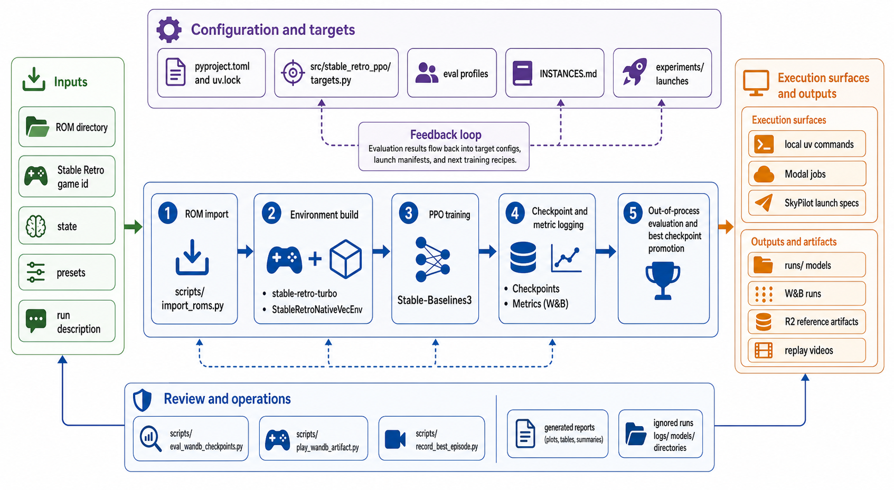

<div align="center">
  

  **Reinforcement-learning workbench for training game agents**
</div>

rlab is a Python CLI for training, evaluating, replaying, and operating reinforcement-learning game agents. It is built around Stable Retro environments, Stable-Baselines3 PPO, W&B artifacts, and queue-backed GPU runners, so a researcher can move from a checked-in experiment spec to a replayable checkpoint without hand-wiring each step.

The normal workflow is to install the CLI once with `uv tool install .`, then use `rlab` commands directly from the repo root. Do not wrap the examples below in `uv run`; the installed tool owns its runtime environment.

## Install

```bash
git clone git@github.com:tsilva/rlab.git
cd rlab
uv --config-file uv-tool.toml tool install --editable .
```

If you are reinstalling after local changes:

```bash
uv --config-file uv-tool.toml tool install --editable --force .
```

This repo uses uv's seven-day `exclude-newer` protection, with a package-specific exception for the pinned `stable-retro-turbo` release recorded in `uv-tool.toml`, `pyproject.toml`, and `uv.lock`. The explicit `--config-file uv-tool.toml` keeps `uv tool install` on the same exception policy as the project environment.

After installation, run commands as plain `rlab ...`:

```bash
rlab --help
rlab validate
```

## Run

Start with a local smoke run:

```bash
rlab train local \
  --game <GameId> \
  --preset smoke \
  --run-name local_smoke \
  --run-description "Local rlab smoke test"
```

Evaluate and watch the resulting model:

```bash
rlab eval \
  --game <GameId> \
  --model runs/local_smoke/final_model.zip \
  --episodes 2 \
  --max-steps 600

rlab play \
  --game <GameId> \
  --model runs/local_smoke/final_model.zip \
  --episodes 3 \
  --max-steps 1200 \
  --fps 30 \
  --scale 4
```

Queue comparable experiments from checked-in spec files:

```bash
rlab train \
  --spec-file experiments/goals/<goal-slug>/specs/<spec>.yaml \
  --runtime-image-ref-file rlab-train-image.json
```

If `rlab-train-image.json` is absent, omit `--runtime-image-ref-file` and `rlab train` will resolve the latest successful train-image artifact by default.

## Commands

```bash
rlab validate                                      # validate goals, specs, recipes, benchmarks, machine config, and policies
rlab train local --game <GameId> --preset smoke --run-description "Smoke test"
rlab train --spec-file experiments/goals/<goal-slug>/specs/<spec>.yaml
rlab eval --game <GameId> --policy random --episodes 2 --max-steps 600
rlab play <entity>/<project>/<run-name>-checkpoint:latest --episodes 0 --policy-env fast
rlab jobs status --goal <goal-slug>
rlab leaders runs --goal <goal-slug> --min-seeds 3
rlab leaders checkpoints --goal <goal-slug>
rlab jobs cancel-train <train_job_id>
rlab fleet policy
rlab fleet plan
rlab fleet reconcile
rlab fleet watch
rlab monitor --view all
rlab benchmark list
rlab benchmark run retro-env-throughput-mario-l11 --dry-run
```

The command surface is intentionally one binary:

- `rlab train` enqueues queue-backed train jobs from checked-in specs.
- `rlab train local` runs direct local training.
- `rlab eval` runs local evaluation, while `rlab eval enqueue` creates eval queue jobs.
- `rlab play` replays a local model path or W&B checkpoint artifact.
- `rlab jobs`, `rlab fleet`, and `rlab monitor` operate the queue and runner fleet.
- `rlab leaders` queries W&B for run/spec winners and best evaluated checkpoints.
- `rlab benchmark` runs named smoke, throughput, fleet, and eval-contract profiles.

## Research Loop

Active research contracts live under `experiments/goals/`. For current Mario work, read the goal's `goal.yaml` before choosing specs, caps, metrics, or promotion criteria.

Train specs are validated against the queue-backed schema before enqueue. Extra research metadata is preserved, but required launch, naming, W&B, seed, selection, and train-config fields must be present and well-formed.

Promotion compares checkpoints by completion rate first, then mean reward, then max x-position. W&B is the source of truth for run and eval metrics; the queue database stores operational job state. Robust evals run out of process and log back to W&B.

## Fleet

Queue-backed training is the supported GPU workflow. `rlab train` creates train jobs, and `rlab fleet` reconciles digest-pinned Docker runner containers on the configured beast hosts.

```bash
rlab fleet status
rlab fleet ps
rlab fleet plan
rlab fleet reconcile
rlab fleet reconcile --watch --interval 30
rlab fleet watch
```

Fleet capacity comes from `experiments/machines.yaml`, `experiments/instances.yaml`, and `experiments/policies/capacity_policy.yaml`. Read `INSTANCES.md` before changing hardware targets, concurrency, cleanup behavior, or beast host recommendations.

## Notes

- Python is pinned to `==3.14.*`; dependency resolution and lock state are managed by `uv`.
- The installed console command is `rlab`; examples should not use `uv run`.
- Runtime support is pinned for macOS arm64 and Linux x86_64 with `stable-retro-turbo`.
- Stable Retro matches ROMs by SHA, not filename. Import the ROMs needed for the game ids you train or play.
- Every training run should include `--run-description`.
- Training logs to W&B and uploads model artifacts unless `--no-wandb-artifacts` is set.
- Queue-backed train jobs are profileless by default and should reference immutable runtime image digests.
- Set `WANDB_API_KEY` for online W&B. For R2/S3-backed reference artifacts, set `CHECKPOINT_BUCKET_URI` or pass `--wandb-artifact-storage-uri`, along with the required `AWS_*` credentials.
- Keep generated checkpoints, logs, videos, W&B files, caches, and scratch outputs out of source control.
- Local eval outputs are written under `runs/local_evals/<run-name>/`.

## Architecture



## License

No license file is present in this repository.
